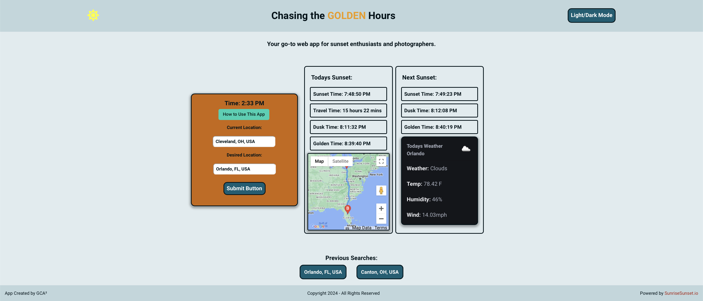

# Chasing The Golden Hours

## Description

Our motivation behind this project was to put our quickly learned coding skills to the test. We wanted to build this project and include all of the many different skills we have learned thus far and implement them and a clean, skillful way. We chose this project for our sunset and photography enthusiasts. We wanted to build a way for those people to find accurate sunset times in different cities, along with GPS directions to get there. Our handy website will also tell you if you are able to make it in time for the beautiful sunset. Throughout building this project, we learned how to communicate and work as a team. Without our teammates, this website would not be complete. We learned crucial problem solving techniques, and how to incorporate everything we have learned, along with everyones ideas, into one project as a group.

To begin building this project, we gave ourselves this acceptance criteria to help us and show us a path to completion: 

GIVEN a sunset dashboard with a form input
WHEN I search for a location
THEN I am presented with current and future sunset times for that location
WHEN I view current sunset times for that location
THEN I am presented with the location, the date, time of sunset, time of dusk, and the time left until sunset
WHEN I view tomorrows sunset times for that location
THEN I am presented with the location, the date, time of sunset, time of dusk, and the time left until tomorrows sunset
WHEN I view the sunset calendar
THEN I am presented with a list of sunset times for the next 45 days for that location
WHEN I select the light or dark mode switch
THEN the display switches to the preferred display type

We also put ourselves in the shoes of someone who would greatly benefit from a website like this. We created this user story:

AS A sunset photographer, I WANT to see the sunset time for multiple cities with directions, SO THAT I can plan my photoshoot times accordingly.

Starting off with this user story and acceptance criteria gave us a clear path to what needed to be done to get this project completed to all of our standards. 

## Installation
To install this repo, simply copy the repo and use git clone in your command line along with the copied repo url with your preferred method.

```bash
git clone git@github.com:andrewpelfrey/ChasingtheGoldenHours.git
```

## Technologies
We used many different technologies to accomplish our final product. We used the CSS framework Bulma, we used jQuery, jQuery UI, dayJS, Google API, Sunrise Sunset API, and notion. 

## link to deployed page
[Chasing the GOLDEN Hours] https://andrewpelfrey.github.io/ChasingtheGoldenHours/

## Image of deployed page


## Credits
ChatGPT helped in splicing recent search to limit it for the last 4 only.

## License
Source code is licensed under the MIT license.
